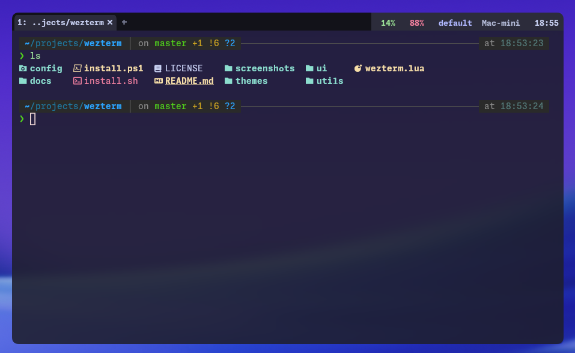

# WezTerm-Pro-Setup

A modular, feature-rich WezTerm terminal configuration with a Catppuccin Mocha theme, powerline tab bar, rich status bar with git integration, and tmux-style keybindings.




## Features

- **Catppuccin Mocha theme** -- carefully tuned color palette across all UI elements
- **Powerline tab bar** -- rounded separators with process-specific Nerd Font icons
- **Rich status bar** -- git branch/dirty state, Python/Node/Rust/Go versions, Docker & Kubernetes context, CPU/RAM usage with labels, battery, hostname (SSH only)
- **Tmux-style leader key** -- `Ctrl+A` leader with vim-style pane navigation
- **Modular architecture** -- configuration split into focused modules under `config/`, `ui/`, `utils/`
- **OpenGL rendering** -- reliable default frontend with 120fps cap
- **Platform-aware** -- automatic macOS/Linux/Windows shell and UI adjustments
- **Kitty graphics protocol** -- image display support
- **Custom notifications** -- toast alerts for bell events in unfocused panes

## Requirements

All dependencies are installed automatically by the installer. Manual installation is only needed if you prefer it.

| Dependency                                                         | Version   | Purpose                 |
| ------------------------------------------------------------------ | --------- | ----------------------- |
| [WezTerm](https://wezfurlong.org/wezterm/)                         | 20240101+ | Terminal emulator       |
| [MonaspiceNe Nerd Font](https://github.com/ryanoasis/nerd-fonts)   | 3.0+      | Primary font with icons |
| [JetBrainsMono Nerd Font](https://github.com/ryanoasis/nerd-fonts) | 3.0+      | Fallback font           |

### Optional tools (displayed in status bar when available)

| Tool               | Status bar segment                 |
| ------------------ | ---------------------------------- |
| `git`              | Branch name, dirty/clean indicator |
| `python` / `conda` | Active virtual environment         |
| `node` (nvm/fnm)   | Node.js version                    |
| `rustc`            | Rust version                       |
| `go`               | Go version                         |
| `docker`           | Active Docker context              |
| `kubectl`          | Kubernetes context                 |

## Download

Grab the latest installer from the [Releases](https://github.com/M3etis/WezTerm-Pro-Setup/releases) page:

| Platform | File | Size |
| -------- | ---- | ---- |
| Windows  | `WezTerm-Pro-Setup-2.0.1.exe` | ~78 MB |
| macOS    | `WezTerm-Pro-Setup-2.0.1.dmg` | ~135 MB |
| macOS    | `WezTerm-Pro-Setup-2.0.1.pkg` | ~136 MB |

Each installer bundles WezTerm, Nerd Fonts, and the full configuration — one click, no prerequisites.

## Installation

### Option A: Standalone installer (recommended)

**Windows** -- double-click the `.exe`, accept the prompts. WezTerm, fonts, and config are installed automatically. Run as Administrator for font registration.

**macOS** -- open the `.dmg`, run the `.pkg` inside. The installer copies `WezTerm.app` to `/Applications`, installs fonts to `~/Library/Fonts`, and deploys the config to `~/.config/wezterm` for the logged-in user (not root).

### Option B: Script install (from repo)

If you prefer to install from source or are on Linux:

```bash
# macOS / Linux
git clone https://github.com/M3etis/WezTerm-Pro-Setup.git
cd WezTerm-Pro-Setup
chmod +x install.sh
./install.sh
```

```powershell
# Windows (PowerShell as Administrator)
git clone https://github.com/M3etis/WezTerm-Pro-Setup.git
cd WezTerm-Pro-Setup
Set-ExecutionPolicy -Scope Process -ExecutionPolicy Bypass
.\install.ps1
```

Both methods:
1. Install WezTerm if not present
2. Back up any existing config
3. Copy configuration files
4. Install MonaspiceNe Nerd Font and JetBrainsMono Nerd Font

### Verifying the install

Launch WezTerm. You should see:

- Catppuccin Mocha color scheme
- Powerline-style tab bar at the top
- Status bar segments at the bottom

If icons appear as boxes, restart your terminal or re-login to refresh the font cache.

### Building the installers yourself

Requires `nsis` (Windows) and `create-dmg` + `pkgbuild` (macOS):

```bash
brew install nsis create-dmg   # macOS only
./build.sh                      # builds both platforms
./build.sh 2.1.0 macos          # macOS only
./build.sh 2.1.0 windows        # Windows only
```

Output lands in `dist/`.

## Architecture

```
wezterm.lua              # Entry point -- composes all modules
 |
 +-- config/             # Configuration modules
 |   +-- appearance.lua  #   Window padding, transparency, cursor, colors
 |   +-- behavior.lua    #   Shell, copy mode, hyperlinks, bell
 |   +-- domains.lua     #   SSH and WSL domain definitions
 |   +-- fonts.lua       #   Font family, size, ligatures
 |   +-- keys.lua        #   Leader key, keybindings, key tables
 |   +-- mouse.lua       #   Mouse bindings (paste, select, click)
 |   +-- performance.lua #   WebGPU, frame rate, scrollback
 |   +-- workspace.lua   #   Tab/workspace behavior
 |
 +-- ui/                 # UI components (event-driven)
 |   +-- tabbar.lua      #   Powerline tab bar with process icons
 |   +-- statusbar.lua   #   Rich status bar composition
 |   +-- notifications.lua # Bell toast notifications
 |   +-- components.lua  #   Reusable status segment factories
 |   +-- colors.lua      #   Catppuccin Mocha palette + semantic mapping
 |   +-- icons.lua       #   Nerd Font icon constants
 |   +-- separators.lua  #   Powerline separator utilities
 |
 +-- utils/              # Utility modules
 |   +-- git.lua         #   Git branch, dirty state, ahead/behind (cached)
 |   +-- battery.lua     #   Battery percentage and icon
 |   +-- hostname.lua    #   System hostname
 |   +-- cwd.lua         #   Working directory resolution
 |   +-- platform.lua    #   OS detection and platform-specific config
 |   +-- process.lua     #   Foreground process detection
 |   +-- path.lua        #   Path manipulation
 |   +-- formatting.lua  #   String formatting helpers
 |
 +-- themes/
 |   +-- catppuccin-mocha.toml  # Standalone color scheme file
 |
 +-- installer/              # Build scripts for distributable installers
 |   +-- macos/build.sh      #   macOS .pkg/.dmg builder
 |   +-- windows/build.sh    #   Windows .exe builder (NSIS)
 |   +-- windows/installer.nsi
 |   +-- windows/install-fonts.ps1
 |
 +-- install.sh              # Script installer (macOS/Linux)
 +-- install.ps1             # Script installer (Windows)
 +-- build.sh                # Master build script
```

Each `config/*.lua` module exports an `apply(config)` function that mutates and returns the config table. UI modules export `setup()` functions that register WezTerm event handlers.

## Keybindings

Leader key: **`Ctrl+A`** (1 second timeout, tmux-style)

### Pane management

| Keybinding             | Action                          |
| ---------------------- | ------------------------------- |
| `Leader + v` (or `\|`) | Split horizontal (side-by-side) |
| `Leader + s` (or `-`)  | Split vertical (top-bottom)     |
| `Leader + h/j/k/l`     | Navigate panes (vim-style)      |
| `Leader + H/J/K/L`     | Resize pane by 5 cells          |
| `Leader + x`           | Close pane (with confirm)       |
| `Leader + z`           | Toggle pane zoom                |

### Tab management

| Keybinding     | Action                   |
| -------------- | ------------------------ |
| `Leader + c`   | New tab                  |
| `Leader + &`   | Close tab (with confirm) |
| `Leader + 1-9` | Switch to tab by number  |
| `Leader + n`   | Next tab                 |
| `Leader + p`   | Previous tab             |
| `Leader + t`   | Rename tab               |

### Workspace management

| Keybinding   | Action                   |
| ------------ | ------------------------ |
| `Leader + w` | Fuzzy workspace switcher |
| `Leader + ,` | Rename workspace         |

### Copy and search

| Keybinding   | Action                      |
| ------------ | --------------------------- |
| `Leader + [` | Enter copy mode (vim-style) |
| `Leader + /` | Search                      |

### System

| Keybinding        | Action           |
| ----------------- | ---------------- |
| `Leader + Ctrl+K` | Clear scrollback |
| `Leader + Ctrl+R` | Reload config    |
| `Leader + Ctrl+P` | Command palette  |
| `Leader + Ctrl+D` | Debug overlay    |
| `Leader + Space`  | Quick select     |

### Global shortcuts (no leader)

| Keybinding               | Action             |
| ------------------------ | ------------------ |
| `Cmd+C` / `Ctrl+Shift+C` | Copy               |
| `Cmd+V` / `Ctrl+Shift+V` | Paste              |
| `Cmd+=`                  | Increase font size |
| `Cmd+-`                  | Decrease font size |
| `Cmd+0`                  | Reset font size    |
| `Cmd+F`                  | Toggle fullscreen  |

### Copy mode (vim-style)

| Key            | Action                   |
| -------------- | ------------------------ |
| `h/j/k/l`      | Move cursor              |
| `w` / `b`      | Word forward/backward    |
| `0` / `$`      | Start/end of line        |
| `g` / `G`      | Top/bottom of scrollback |
| `v` / `V`      | Character/line selection |
| `y`            | Yank (copy) and exit     |
| `q` / `Escape` | Exit copy mode           |

## Customization

All configuration lives in `config/` modules. Edit the relevant file and reload with `Leader + Ctrl+R`.

### Change the leader key

Edit `config/keys.lua`:

```lua
M.leader = {
  key = 'b',            -- was 'a'
  mods = 'CTRL',
  timeout_milliseconds = 1000,
}
```

### Adjust transparency

Edit `config/appearance.lua`:

```lua
config.window_background_opacity = 0.85   -- 0.0 (transparent) to 1.0 (opaque)
config.macos_window_background_blur = 30  -- blur radius (macOS only)
```

### Change font size

Edit `config/fonts.lua`:

```lua
config.font_size = 16.0   -- was 14.0
```

Or use `Cmd+=` / `Cmd+-` at runtime.

### Add SSH servers

Edit `config/domains.lua`:

```lua
config.ssh_domains = {
  {
    name = 'prod-server',
    remote_address = '192.168.1.100',
    username = 'deploy',
  },
  {
    name = 'dev-box',
    remote_address = 'dev.example.com',
    username = 'developer',
    multiplexing = 'None',
  },
}
```

### Add WSL distributions (Windows)

Edit `config/domains.lua`:

```lua
config.wsl_domains = {
  {
    name = 'WSL:Ubuntu',
    distribution = 'Ubuntu',
    default_cwd = '/home/user',
  },
}
```

### Change the color scheme

Replace `config/appearance.lua` line 61:

```lua
config.color_scheme = 'Tokyo Night'  -- or any WezTerm built-in scheme
```

Or drop a `.toml` theme file into `themes/` and reference it.

### Adjust status bar components

Edit `ui/statusbar.lua` -- comment out or reorder segments in `build_right_status()` or `build_left_status()`.

## Performance notes

- **WebGPU frontend** is enabled by default (`config/performance.lua`). Falls back to OpenGL on systems without GPU support.
- **Git status caching** -- branch and dirty state are cached for 5 seconds per directory to avoid subprocess overhead during rapid redraws.
- **Version detection caching** -- language/tool versions (`node --version`, `rustc --version`, etc.) are detected once and cached in memory.
- **Scrollback** is set to 10,000 lines. Reduce this if memory usage is a concern.
- **Animation FPS** is capped at 60; max rendering FPS at 120. Lower `max_fps` on older hardware.
- **macOS blur** (`macos_window_background_blur = 20`) may impact performance on non-Retina or older machines. Set to `0` to disable.

## Troubleshooting

### Icons appear as boxes / missing glyphs

Install the required Nerd Fonts. Ensure your terminal profile uses `MonaspiceNe Nerd Font` or `JetBrainsMono Nerd Font`.

### Status bar not visible

WezTerm's status bar is enabled by default. Check that `ui/statusbar.lua` is loaded in `wezterm.lua`. If you see errors, run `Leader + Ctrl+D` to open the debug overlay.

### Leader key not working

The leader key uses a 1-second timeout. Press `Ctrl+A` and then the second key within 1 second. Verify the leader key binding in `config/keys.lua`.

### Config changes not taking effect

Reload the config with `Leader + Ctrl+R` or restart WezTerm. Lua syntax errors will be shown in the debug overlay (`Leader + Ctrl+D`).

### High CPU usage

- Reduce `config.max_fps` in `config/performance.lua`
- Set `config.window_background_opacity = 1.0` to disable transparency
- Set `config.macos_window_background_blur = 0` to disable blur
- Reduce `config.scrollback_lines` if working with very large outputs

### Git status slow in large repos

The git module caches results for 5 seconds. For very large monorepos, you can increase `CACHE_TTL` in `utils/git.lua`.

### WebGPU not available

If WezTerm fails to start with WebGPU, change the frontend in `config/performance.lua`:

```lua
config.front_end = 'OpenGL'  -- fallback
```

## FAQ

**Q: Can I use this config without Nerd Fonts?**
A: Icons and powerline separators will not render correctly. You can replace icon references in `ui/icons.lua` with ASCII alternatives, but the visual design relies on Nerd Font glyphs.

**Q: How do I add my own status bar segments?**
A: Add a function to `ui/components.lua` that returns WezTerm format segments, then call it from `ui/statusbar.lua` in `build_right_status()` or `build_left_status()`.

**Q: Does this work on Windows?**
A: Yes. Platform detection in `utils/platform.lua` applies Windows-specific settings automatically. WSL domain configuration is available in `config/domains.lua`.

**Q: How do I switch to a light theme?**
A: Change `config.color_scheme` in `config/appearance.lua` and update the palette in `ui/colors.lua` to match. The Catppuccin Latte palette is the light counterpart.

**Q: Can I disable the status bar?**
A: Remove or comment out `require('ui.statusbar').setup()` in `wezterm.lua`.

**Q: How do I update to a new version?**
A: Download the latest installer from [Releases](https://github.com/M3etis/WezTerm-Pro-Setup/releases) and run it. Existing config is backed up automatically. Or pull the repo and run `./install.sh` / `.\install.ps1` again.

## License

MIT

## Author

- m3etis
- m3etis@gmail.com
